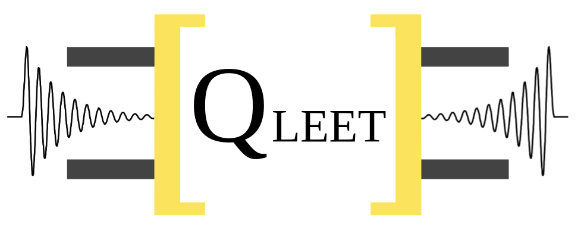
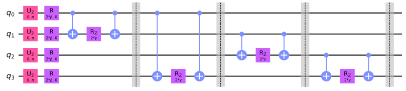

.. qLEET documentation master file, created by
   sphinx-quickstart on Sat Sep 25 14:14:06 2021.
   You can adapt this file completely to your liking, but it should at least
   contain the root `toctree` directive.

Welcome to qLEET's documentation!
=================================

qLEET is an open-source library for exploring Loss landscape, Expressibility, Entangling capability 
and Training trajectories of noisy parameterized quantum circuits.

.. raw:: html

   

Will support Qiskit’s, Cirq’s and pyQuil's quantum circuits and noise models.

Our package provides opportunities to improve existing algorithms like VQE, QAOA by utilizing intuitive 
insights from the ansatz capability and structure of loss landscape.

The aim of the library is to facilitate research in designing new hybrid quantum-classical algorithms.

Types of Plots
--------------

There are several types of analysis supported by our module. They are:

* Expressibility Plot.
* Loss Landscape Plot.
* Training Path Plot.
* Entanglement Alibility Value.
* Histogram Plot.

More types of analysis will be added, be sure to raise an issue for feature requests on the repository.

.. image:: ../images/expressibility.gif
   :height: 500
   :width: 500

.. image:: ../images/losslandscape.gif
   :height: 500
   :width: 500

.. image:: ../images/trainingpath.gif
   :height: 500
   :width: 500

Examples of Circuit
-------------------

The library comes with a few Pre-built circuits to which you can analyze out of the box.

One of those is QAOA for computing Max Cut of a Graph.

.. image:: ../images/graph.png
   :height: 150
   :width: 200

.. toctree::
   :maxdepth: 4
   :caption: Contents:

   _apidoc/qleet

Indices and tables
==================

* :ref:`genindex`
* :ref:`modindex`
* :ref:`search`
